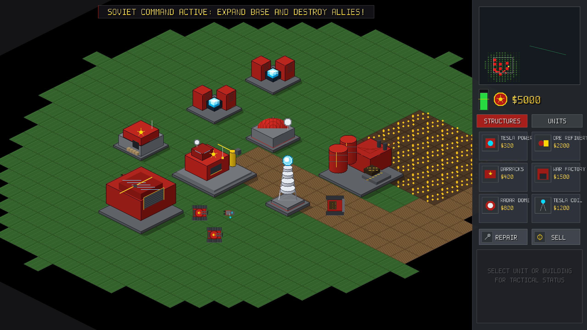

# Command & Conquer: Red Alert — Soviet Supremacy
### Minimal Working RTS Clone in Modern C++17 & OpenGL (macOS)

A high-performance, standalone Command & Conquer: Red Alert clone playing the **Soviet (USSR) faction**, featuring iconic Soviet units and defenses, economy harvesting, dynamic procedural sound effects, fog of war, and an autonomous Allied AI enemy.



---

## Key Features

### 1. Authentic Isometric Perspective (2:1 Dimetric RTS View)
- **Classic 2:1 Dimetric Grid**: Diagonal 64x32 pixel diamond terrain tiles (`TERRAIN_GRASS`, `TERRAIN_DIRT`, `TERRAIN_WATER`, `TERRAIN_ROCKS`, `TERRAIN_ORE`) with isometric fog-of-war shrouds.
- **2.5D Depth Sorting (Y-Sorting)**: Buildings, infantry, tanks, and projectiles are sorted and rendered in ascending ground-Y order, creating proper occlusion when units navigate behind or in front of structures.
- **Retina Display 1:1 Coordinate Calibration**: Separation between logical window points (`winW x winH`) and high-DPI framebuffer pixels (`fbW x fbH`) ensures mouse clicks, drag boxes, radar minimap, and building placement align pixel-perfect with zero offset.
- **Diamond Building Placement**: Interactive isometric diamond grid preview following the cursor with green (valid) and red (obstructed) placement feedback.

### 2. Playable Faction: Soviet Red Army (USSR)
- **Soviet Construction Yard (ConYard)**: Base command hub with radar mast and yellow crane.
- **Tesla Reactor (Power Plant)**: Generates 160 power with glowing cyan induction coils.
- **Ore Refinery**: Industrial refinery with unloading ramp and conveyor hopper. Automatically deploys a Soviet Ore Harvester!
- **Soviet Barracks**: Fortified bunker training Soviet infantry.
- **Soviet War Factory**: Heavy industrial hangar manufacturing armored vehicles.
- **Radar Dome**: Unlocks full tactical radar sweep.
- **Tesla Coil**: The iconic Soviet defensive tower! When base power is online, detects approaching enemy units, charges up with an ascending electrical hum, and discharges a devastating 140-damage lightning strike with animated branching electric arcs!

### 2. Soviet Unit Lineup
- **Conscript**: Resilient infantry armed with AK-47 assault rifle ($100).
- **Tesla Trooper / Shock Trooper**: Heavy insulated armor, discharging portable electric arcs ($300).
- **Soviet Heavy Tank**: Dual-cannon battle tank firing alternating shells ($800).
- **Mammoth Tank**: Behemoth super tank with quad treads, dual 120mm main cannons, side anti-armor missile launchers, and self-repair ($1500).
- **V2 Rocket Launcher**: Long-range ballistic missile artillery with smoke plume exhaust ($700).
- **Soviet Ore Harvester**: Heavy hauler with automated mining cycle: drives to ore fields, extracts gold ore crystals, returns to refinery dock to unload credits, and repeats ($1000).

### 3. Allied Enemy (Blue AI)
- Allied base situated across the river in the top-right corner with ConYard, Power Plant, Barracks, War Factory, and machine-gun Pillbox bunkers.
- Enemy AI autonomously trains Allied Riflemen, Light Tanks, and Medium Tanks, assembling strike teams and launching coordinated assault waves against the Soviet base.

### 4. Economy & Fog of War
- Starting funds: **$5,000**.
- Crystalline Ore Fields distributed across the map with natural slow regeneration.
- Classic Fog of War / Shroud: Unexplored terrain is covered in pitch-black shroud, dynamically revealed as Soviet units advance across the map.

### 5. Procedural 16-Bit Audio Engine (OpenAL)
100% self-contained in C++ with zero external audio assets required:
- Tactical radio chirps & confirmation squelches for selection and movement orders.
- Crisp AK-47 rifle bursts.
- Deep resonant tank cannon explosions.
- Mammoth double thunderclap artillery blasts.
- Rising electrical whine and violent lightning crackle for Tesla Coil & Tesla Trooper.
- Propellant whoosh for V2 rockets.
- Sub-bass rolling explosion rumbles.
- Cash register coin chimes when harvesters unload ore at the refinery.
- Red Alert klaxon siren when base is attacked.
- Mechanical chimes for completed construction and unit deployment.

### 6. C&C Command Sidebar UI
- **Radar Minimap**: Real-time overview showing terrain, red Soviet units, blue Allied units, yellow ore fields, camera viewport box, and an active rotating radar sweep line. Click or drag to jump camera.
- **Power Bar Meter**: Visual gauge displaying current power output vs base drain (green when sufficient, red when deficit disables Tesla coils).
- **Credit Counter**: Soviet crest with live credit balance.
- **Build Queue**: Tabs for Structures and Units, visual progress overlays, and "READY" indicators.
- **Building Placement Mode**: Translucent green/red grid preview following the mouse over the battlefield. Left-click places, right-click cancels and refunds.
- **Action Buttons**: Repair mode (wrench) and Sell mode ($).

---

## Controls & Shortcuts

| Action | Control |
|---|---|
| **Select Units / Buildings** | Left-Click friendly unit/building or Left-Drag Selection Box |
| **Move to Location** | **Click any ground location** (Left-Click or Right-Click with units selected) |
| **Attack Enemy Target** | **Click enemy unit or building** (Left-Click or Right-Click with units selected) |
| **Harvest Ore Field** | **Click ore crystals** with Ore Harvester selected |
| **Deselect All** | `Escape` or Left-Click on empty ground when no units are moving |
| **Pan Camera** | `W`, `A`, `S`, `D` or `Arrow Keys` or Middle-Mouse Drag |
| **Zoom In / Out** | Mouse Scroll Wheel (0.6x to 1.8x) |
| **Home to Construction Yard** | `Space` or `H` |
| **Save Screenshot** | `F12` (saves to `docs/screenshot.png`) |
| **Pause Game** | `P` |
| **Assign Control Group** | `Ctrl + 1` ... `Ctrl + 9` |
| **Select Control Group** | `1` ... `9` |
| **Cancel Placement Mode** | `Escape` or Right-Click |

---

## Building and Running

### Prerequisites
- macOS (Apple Silicon or Intel)
- Clang++ with C++17 support
- Homebrew packages: `glfw`, `glm`

```bash
brew install glfw glm
```

### Build with Make
```bash
make
./redalert
```

### Build with CMake
```bash
mkdir -p build && cd build
cmake ..
make -j4
./redalert
```
